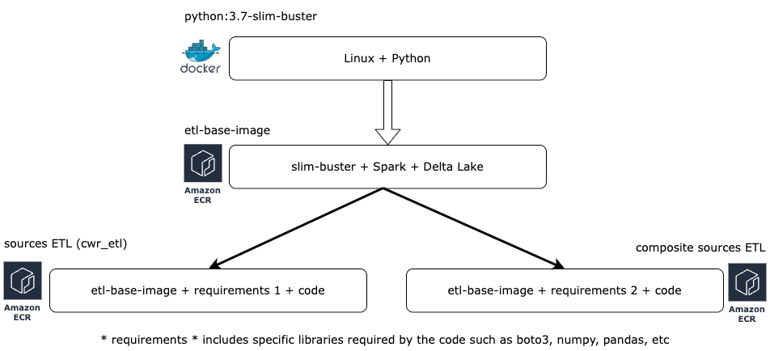

# etl-base-image
Docker image with the base libraries for the ETLs.

Using the [python:3.7-slim-buster](https://github.com/docker-library/python/blob/00b80a3dfc595e9c58ec52cc9ae8349cf10767a4/3.7/slim-buster/Dockerfile) `docker pull python:3.7-slim-buster` as base Docker base image.

The image is to have a base image that is stable and not dependent on vendor changes (for example, changes in jar versions that may affect the creation of docker images)



## Image Package versions

| Name 	| version 	|
|---	|---	|
| OpenJDK <br>(Java) 	|# java -version<br>openjdk version "1.8.0_292"<br>OpenJDK Runtime Environment (AdoptOpenJDK)(build 1.8.0_292-b10)<br>OpenJDK 64-Bit Server VM (AdoptOpenJDK)(build 25.292-b10, mixed mode) 	|
| Python 	| # python --version<br>Python 3.7.17 	|
| PySpark 	| # pyspark --version<br>  version 3.1.3<br>Using Scala version 2.12.10, OpenJDK 64-Bit Server VM, 1.8.0_292 	|
| DeltaLake 	| # ls /opt/spark/jars/*delta*<br>/opt/spark/jars/delta-core_2.12-1.0.0.jar 	|

### BUILD
```shell
$ sudo docker build -t etl-base-image .
```

Open it locally from a shell:
```shell
$ docker run -it --entrypoint /bin/bash etl-base-image
```

## Update the AWS repository

To update the AWS ECR log into the AWS account and run:
```shell
# after building the image locally run:
AWS_ACCOUNT_ID=$(aws sts get-caller-identity --query "Account" --output text)
AWS_REGION=us-east-1              # change this accordingly
aws ecr get-login-password --region $AWS_REGION | docker login --username AWS --password-stdin $AWS_ACCOUNT_ID.dkr.ecr.$AWS_REGION.amazonaws.com
# then:
docker tag $(sudo docker images | awk '{print $3}' | awk 'NR==2') $AWS_ACCOUNT_ID.dkr.ecr.$AWS_REGION.amazonaws.com/etl-base-image
docker push $AWS_ACCOUNT_ID.dkr.ecr.$AWS_REGION.amazonaws.com/etl-base-image
```

## Usage
Reference the image in ECR adding the following to the Dockerfile:
```shell
ARG AWS_ACCOUNT_ID
FROM ${AWS_ACCOUNT_ID}.dkr.ecr.$AWS_REGION.amazonaws.com/etl-base-image
```
